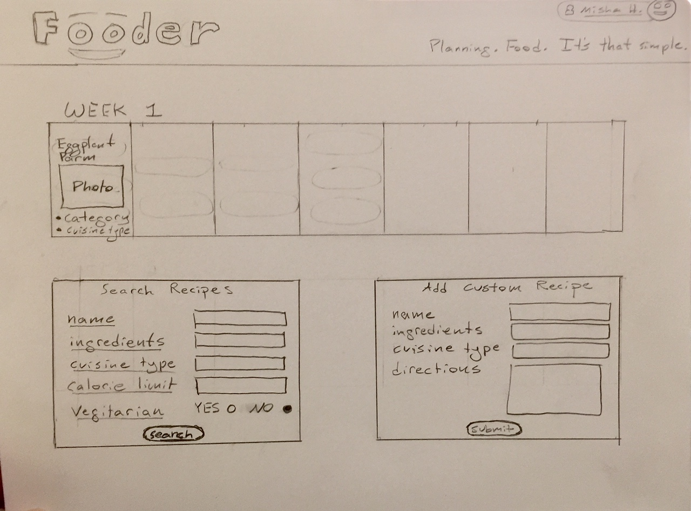
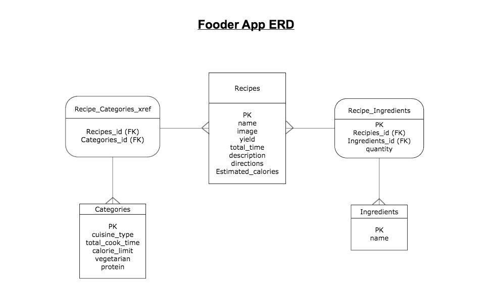

# Fooder!

## Meal planner app

## Project2

Created by: Misha Holzman

<h3>Are you a busy individual who likes to eat well and eat right? Try Fooder meal planner to organize your week and cook easy delicious recipes without breaking a sweat! With tons of recipes to choose from and a fun calander to plan out your week, you will never worry about planning dinner again.</h3>  

## User Stories:

### Who is the user?

The Fooder app's target market is young professionals and busy family members that benefit from planing recipes to cook ahead of time in an easy and visually appealing manner. Individuals using the app want to eat healthy meals, avoid eating out all the time to budget their money, and are conscious about how long it takes to make a meal every night. The app is designed to be visually and esthetically pleasing and be fun to use, targeting a younger crowd who appreciate such graphics.

### What features does Fooder offer?

- Allows you to look up recipes based on cuisine category. Categories include cuisine type, and recipes include information about cook-time, calories per serving, yield, and if it is vegitarian.
- The user has a weekly calander on the landing page that allows you to log a recipe you want to use for a particular day. Scroll down the landing page to search for a tasty recipe for any day of the week based on category. 
- A page that allows the user to enter their own favorite recipes and store it for later use in the database. 
- Recipes will be categorized to make searching easier and more specific. 
- There will be a form delete recipes you don't like or update a recipe to your liking.
- A dropdown menu will take you to these previously mentioned forms, and also a page for cooking tips and tricks. 

---

### Wireframe:

 

### ERD:

 

### Link to Deloyed Site via Heroku: https://fooderapp.herokuapp.com/

<a href="https://www.cookinglight.com/weeknight-meal-planner">Link to similar website</a>

<h4>Technologies used: Express, JSX, Sequelize, React, Node.js, CSS</h4>

<a href="https://git.generalassemb.ly/mholzman/Fooder_Project2">Link to Source Code</a>

