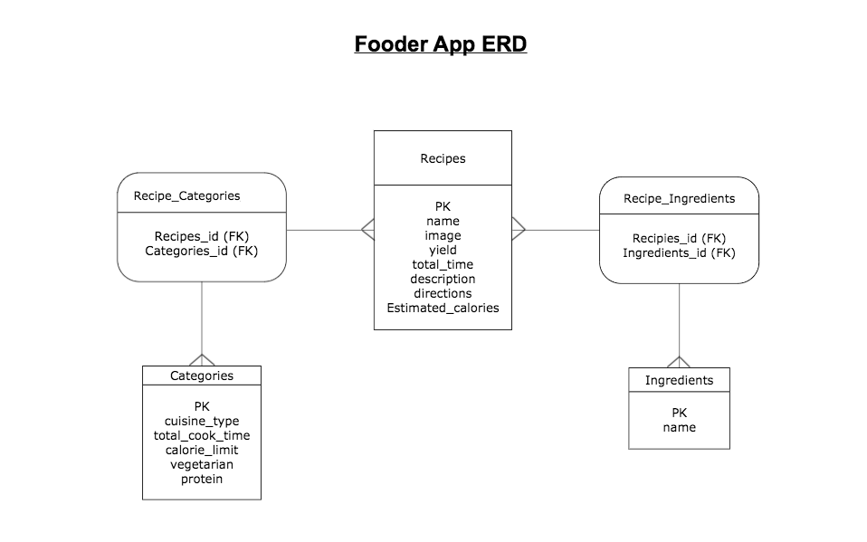

# Fooder_Project2

## Meal planner app

Created by: Misha Holzman

## User Stories:

### Who is the user?

The Fooder app's target market is young professionals that benefit from planing meals ahead of time in an easy and visually appealing manner. Individuals using the app want to eat healthy meals, avoid eating out all the time to budget their money, and are conscious about how long it takes to make a meal every night.

### What features does Fooder offer?

- Allows you to look up recipes based on your health goals. Categories include cuisine type, cook-time, calorie limit, vegitarian, and protein.
- The user has a weekly calander that allows you to log a recipe you want to use for a particular day and easily view the week's meals. 
- There will be a form that allows you to search the database for particular recipes based on your preferances for the day. 
- Recipes will be categorized to make searching easier and more specific.
- There will be a form to enter and save your own favorite recipes.
- A dropdown menu with dates will help you select the date for which you want to add a recipe. 

---

### Wireframe:

 

### ERD:

 

<a href="https://www.cookinglight.com/weeknight-meal-planner">Link to similar website</a>

// notes from DefaultLayout:
//< title>{title}</title >
// {children}

// youtube -> react conponents and props or just react props
// https://reactjs.org/docs/introducing-jsx.html
//  -> functional and props (something like that)   -> read 2 and 4 not 5
// do a codepen –>